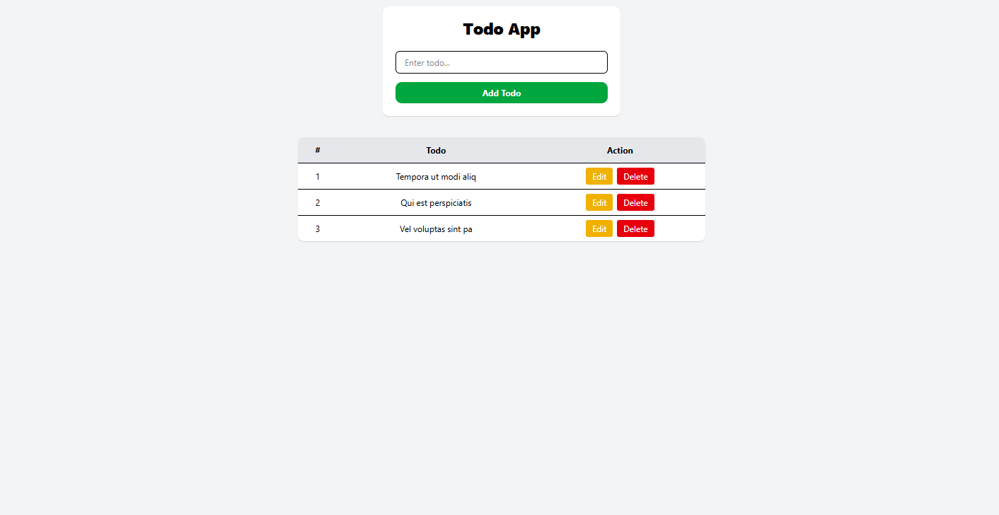

# Firebase Todo App

A modern, responsive Todo application built with React and Firebase Realtime Database for seamless CRUD operations.

## Description

This project is a full-stack Todo application that demonstrates the integration of React with Firebase Realtime Database. Users can create, read, update, and delete todos with real-time synchronization across all connected clients.


## Features

- **Create Todos**: Add new todo items with a simple form
- **Read Todos**: View all todos in a clean, responsive table
- **Update Todos**: Edit existing todos inline
- **Delete Todos**: Remove todos with confirmation
- **Real-time Sync**: Changes are instantly reflected across all users
- **Loading States**: Visual feedback for all operations (add, update, delete, fetch)
- **Error Handling**: Comprehensive error messages for failed operations
- **Success Notifications**: Toast-like messages for successful actions
- **Responsive Design**: Mobile-friendly interface using Tailwind CSS

## Technologies Used

- **Frontend Framework**: React 19
- **State Management**: Redux Toolkit
- **Build Tool**: Vite
- **Styling**: Tailwind CSS
- **HTTP Client**: Axios
- **Database**: Firebase Realtime Database
- **Routing**: React Router DOM
- **Linting**: ESLint


## Usage

1. Open your browser and navigate to `http://localhost:5173`
2. Add new todos using the input form
3. View all todos in the table below
4. Edit todos by clicking the "Edit" button
5. Delete todos by clicking the "Delete" button
6. All changes are automatically synced with Firebase

## Available Scripts

- `npm run dev` - Start the development server
- `npm run build` - Build the project for production
- `npm run preview` - Preview the production build
- `npm run lint` - Run ESLint for code linting

## Project Structure

```
src/
├── api/
│   └── apiInstance.js          # Axios instance for Firebase API calls
├── app/
│   └── store.js                # Redux store configuration
├── features/
│   └── todo/
│       ├── thunk.js            # Async thunks for API operations
│       └── todoSlice.js        # Redux slice for todo state management
├── assets/                     # Static assets
├── App.jsx                     # Main application component
├── main.jsx                    # Application entry point
└── index.css                   # Global styles
```

## Contributing

Contributions are welcome! Please feel free to submit a Pull Request.

## output

